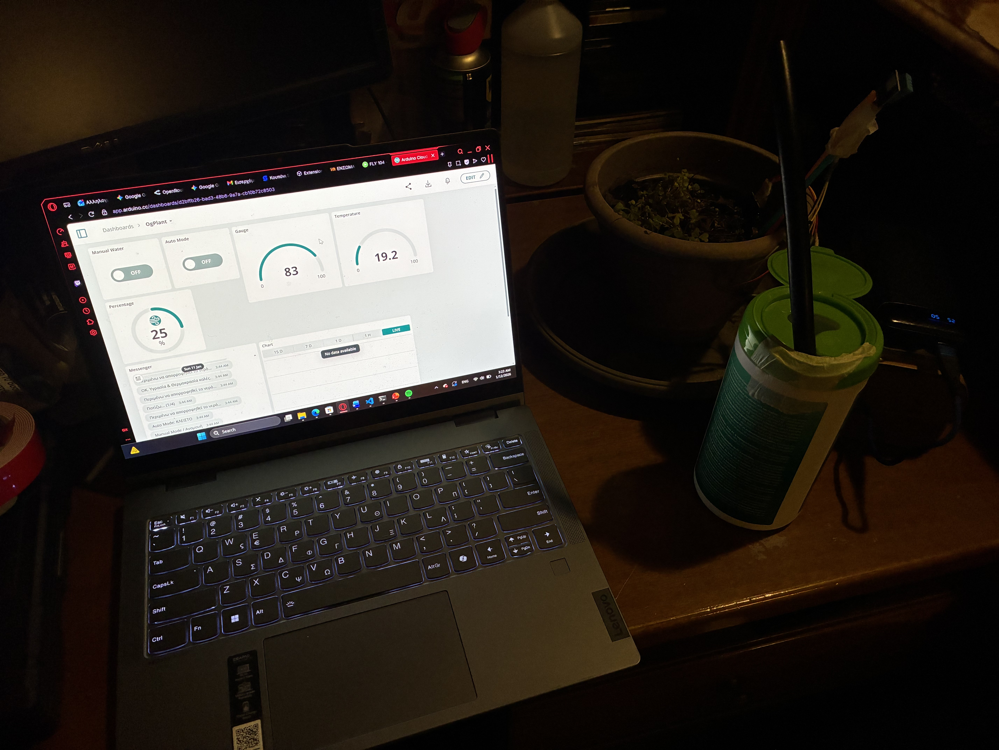

# 🌱 Smart IoT Plant Watering System

An automated, cloud-connected plant irrigation system built with an **ESP8266 (NodeMCU)** and the **Arduino IoT Cloud**. This project monitors soil moisture and environmental conditions in real-time, automatically watering the plant when needed while providing remote control and telemetry via a Web Dashboard.

## 🚀 Features

* **Smart Auto-Watering:** Continuously monitors soil moisture and triggers a 5V water pump when moisture drops below 50%, stopping at 55%.
* **Remote Web Dashboard:** Live tracking of Soil Moisture, Temperature, and Humidity from anywhere using the Arduino IoT Cloud.
* **Manual Override:** Web-based toggle to water the plant manually when Auto-Mode is disabled.
* **Fail-Safe Mechanism:** Built-in "Emergency Stop" timer (10 seconds) that cuts off the pump automatically to prevent flooding in case of sensor failure or tube dislocation.
* **Real-time Environmental Telemetry:** Uses a DHT11 sensor to monitor room conditions.

## 🛠️ Hardware Components

* **Microcontroller:** NodeMCU V1.0 (ESP-12E / ESP8266)
* **Sensors:** * Analog Capacitive/Resistive Soil Moisture Sensor
    * DHT11 Temperature & Humidity Sensor
* **Actuators:** 5V Submersible Water Pump
* **Relay:** 1-Channel 5V Relay Module (to safely switch the pump)
* **Power:** 5V USB Power Bank / Wall Adapter
* **Misc:** Breadboard, Jumper wires, DIY tubing 

## 💻 Technologies Used

* **C / C++** (Arduino Framework)
* **Arduino IoT Cloud** (Platform & Dashboard)
* **IoT Concepts** (Telemetry, Actuation, State Management)

## 📸 Project Showcase

*(Tip: Upload a photo of your web dashboard and a photo of your physical setup here. Even if it's a DIY prototype, it shows hands-on maker skills!)*

## ⚙️ How It Works (Circuit Logic)

1.  **Sensing:** The Soil Moisture sensor reads analog values (mapped to 0-100%).
2.  **Processing:** The ESP8266 processes the data every 2 seconds to avoid cloud throttling.
3.  **Actuation:** If `Auto Mode` is ON and moisture `< 50%`, the ESP8266 sends a `HIGH` signal to the Relay, closing the circuit and powering the 5V Pump.
4.  **Safety:** A timer tracks the pump's running duration. If it exceeds 10,000 ms (10 seconds) without reaching the target moisture, the system enters an `Emergency Stop` state, shutting down the pump to prevent water spillage.

## 🚀 Future Improvements

* Replace breadboard setup with a soldered perfboard or custom PCB.
* Implement low-power Deep Sleep mode for battery operation.
* Add push notifications for "Water Tank Empty" status.

---
*Developed by [Το Όνομά σου Εδώ] - Feel free to reach out or contribute!*
